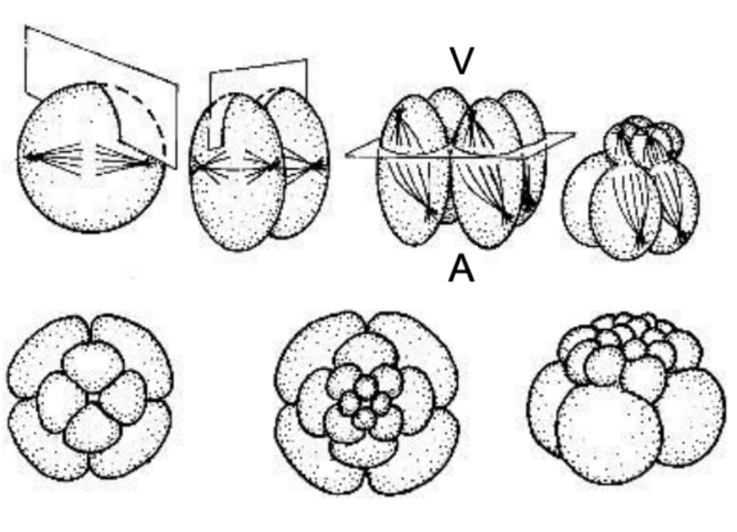
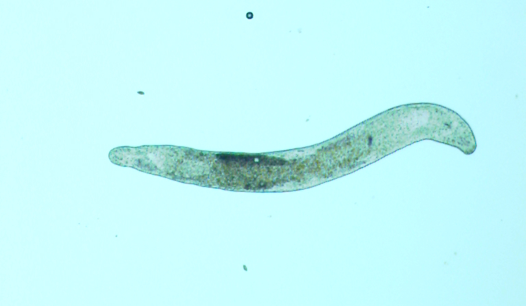
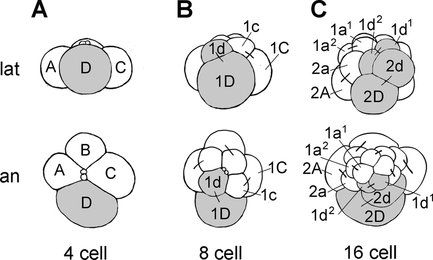
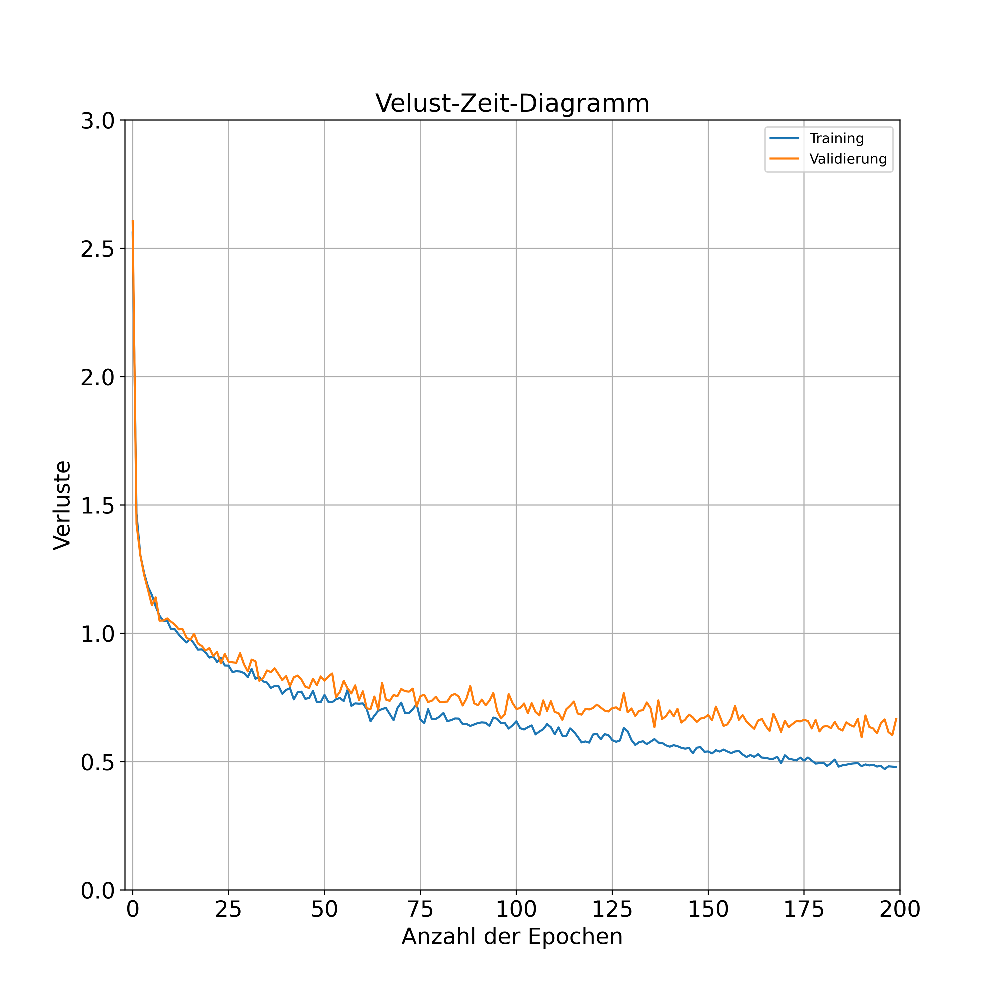
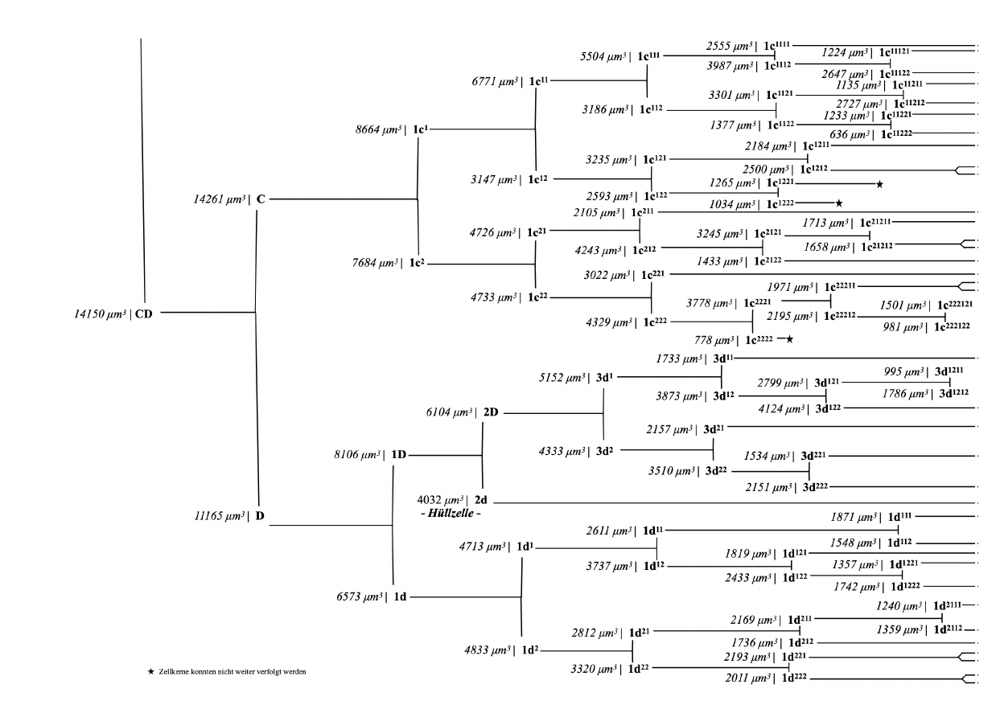

# Quantitative Image-Analysis of Blastomeres in the Early Embryonic Development of *Macrostomum lignano* (Plathelminthes, Macrostomorpha) - *Thesis Summary*

A short walkthrough of my Bachelor's thesis: quantitative image analysis of spatial distribution in early embryonic development on *Macrostomum lignano*. I'm not explaining the exact procedure.

- **Code:** Not publicly available
- **Data:** Provided by supervisor; not publicly shareable

## Abstract

The goal of this thesis was to apply instance segmentation (supervised) in a developmental biology context, thereby gaining new insights into the spatial distribution of cell nuclei during the early embryonic development of *Macrostomum lignano*, an animal undergoing spiral cleavage. Two *M. lignano* embryos were recorded using light-sheet fluorescence microscopy (SPIM), followed by determining cell lineage trees for both embryos. The model was trained using the dataset from Embryo I and then applied to both embryos. Comparable segmentations of the cell nuclei were obtained for both embryos.

## Introduction

### Spiral Cleavage

- A conserved, early embryonic development pattern in spiralian animals (Mollusca, Annelida, Platyhelminthes and other taxa)
- Fig. 1 shows an illustration of the spiralian cleavage

    

    <em>Fig. 1: Illustration of Spiralian Cleavage. <a href="https://www.researchgate.net/figure/Cleavage-pattern-during-spiralian-development-Each-row-shows-schematics-of-lateral-lat_fig1_318301853">Source</a> (acc. 12 Sep 2026).</em>

### *Macrostomum lignano*

- [*M.lignano*](https://doi.org/10.1186/s13227-020-00150-1) is a free-living, hermaphroditic flatworm
- Model organism for regeneration research
- Fig. 2 shows such a flatworm

    

    <em>Fig. 2: Macrostomum lignano. <a href="https://earthlingnature.wordpress.com/2020/04/03/friday-fellow-lignanos-macrostomum/">Source</a> (acc. 12 Sep 2026).</em>

### EmbedSeg (Segmentation Model)

- [EmbedSeg](https://doi.org/10.1016/j.media.2022.102523) is an instance segmentation method for microscopy images
- Official GitHub page: [https://github.com/juglab/EmbedSeg](https://github.com/juglab/EmbedSeg)

### Mastodon (Cell Lineage Tracking)

- [Mastodon](https://doi.org/10.64898/2025.12.10.693416) is a large-scale tracking and track-editing framework for large, multi-view images
- Official GitHub page: [https://github.com/mastodon-sc/mastodon](https://github.com/mastodon-sc/mastodon)

### Nomenclature

- I mainly used the [standard nomenclature](https://doi.org/10.1575/1912/605) by Conklin using slight adaptations

    

    <em>Fig. 3: Illustration of the standard nomenclature of spiralians. <a href="http://placozoa.co.uk/student-2017/Jakob-Lecture-8-Annelida.pdf">Source</a> (acc. 12 Sep 2026). </em>

## Results

### History of the Model Training

- History of the training from the model on embryo I
- The generalization was not optimal, still applicable for the purpose of this thesis

<table align="center">
<tr>
<td align="center"></td>
<td align="center"></td>
</tr>
</table>

    <em>Fig. 4: Scatter plots of training history of the Training of Embryo I. Left: Verlust-Zeit-Diagramm (engl. Loss-Time-Diagram). Right: Genauigkeits-Zeit-Diagramm (engl. Precision-Time-Diagram).</em>

### Cell Lineage with Maximum Spatial Distribution

- The maximum spatial distribution (in µm³) of the tracked blastomeres in embryo 2 mapped onto the cell lineage (from tracking).

    

    

    <em>Fig. 5: Spatial distribution (in µm³) of the tracked blastomeres.</em>

### Cell Nuclei Volume over Time from Embryo 2

- Fig. 6 illustrates the quantitative image analysis of the blastomeres volumes, just before the third cleavage of the second embryo

<table align="center">
<tr>
<td align="center"></td>
<td align="center"></td>
</tr>
<tr>
<td align="center"></td>
<td></td>
</tr>
</table>

    <em>Fig. 6: Top-Left: Zygote before the first splits. Top-Right: Both blastomeres of the first division (AB & CD). Bottom-Left: Four blastomeres of the second division (A & B & C & D).</em>

### Cell Nuclei Volume Comparison of Both Embryos over Time

- Fig. 7 demonstrates the third split during the early embryogenesis in both embryos (A>1A&1a; B>1B&1b; C>1C&1c; D>1D&1d) in both embryos (Left: Embryo 1 & Right: Embryo 2)

<table align="center">
<tr>
<td align="center"></td>
<td align="center"></td>
</tr>
<tr>
<td align="center"></td>
<td align="center"></td>
</tr>
</table>

    <em>Fig. 7: Embryo Comparison of third division. Top-Left: A cell., left Embryo 1, right Embryo 2. Top-Right: B cell, left Embryo 1, right Embryo 2. Bottom-Left: C cell, left Embryo 1, right Embryo 2. Bottom-Right: A cell, left Embryo 1, right Embryo 2.</em>

